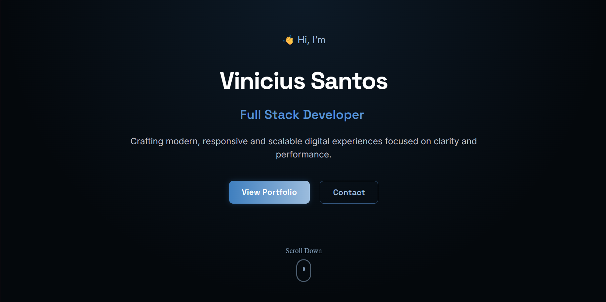

# 🌐 Vinicius Santos — Landing Page

Bem-vindo à minha landing page pessoal!  
Este projeto foi desenvolvido para apresentar minha identidade profissional como **Full Stack Developer**, com foco em **design limpo**, **experiência fluida** e **performance**.

---

## 🖥️ Preview



> *Demonstração do site completo — com transições suaves, seção de contato funcional e layout responsivo.*

🔗 **Acesse online:** [https://vinicius-landing.vercel.app](https://vinicius-landing.vercel.app)

---

## 🚀 Tecnologias Utilizadas

Este projeto foi construído com foco em modernidade, escalabilidade e animações suaves:

- ⚛️ **React.js** — estrutura base da aplicação  
- 💅 **CSS3** — estilização customizada, com foco em responsividade  
- 🎞️ **Framer Motion** — animações suaves e interativas  
- 🖋️ **React Type Animation** — efeitos tipográficos dinâmicos  
- ☁️ **Vercel** — hospedagem e deploy contínuo  

---

## 🧭 Estrutura da Página

A landing é composta por seções que refletem a jornada do visitante:

| Seção | Descrição |
|-------|------------|
| 🏠 **Hero** | Apresentação principal com animações e CTA inicial |
| 💡 **Highlights** | Destaques sobre minhas habilidades e valores |
| 💬 **CTA** | Chamada para contato direto ou colaboração futura |
| ⚡ **Footer** | Assinatura e links sociais |

---

## 🪄 Funcionalidades

- Animações de entrada e rolagem com **Framer Motion**
- Indicador de rolagem para navegação fluida
- Responsividade total (desktop, tablet e mobile)
- Estilo visual minimalista e consistente com minha marca pessoal
- Scroll suave entre seções  

---

## 🎨 Paleta de Cores

| Cor | Código | Uso |
|------|---------|------|
| Azul principal | `#3f7fbf` | Destaques e botões |
| Azul claro | `#9bbcdd` | Gradientes e detalhes |
| Cinza escuro | `#04080c` | Fundo principal |
| Cinza neutro | `#bcbfc4` | Textos secundários |
| Branco | `#ffffff` | Títulos e contrastes |

---

## 🧱 Estrutura de Pastas

src/
├── assets/ # Imagens, ícones e favicons
├── components/ # Componentes principais (Hero, CTA, etc.)
├── styles/ # Arquivos CSS organizados
├── App.js # Componente raiz
└── index.js # Renderização principal


---

## ⚙️ Como Rodar o Projeto

Clone o repositório e rode o projeto localmente:

```bash
git clone https://github.com/ViniciuPSantos/Vinicius-Landing
cd vinicius-landingpage
npm install
npm run dev
